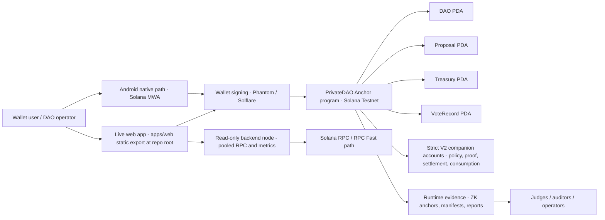
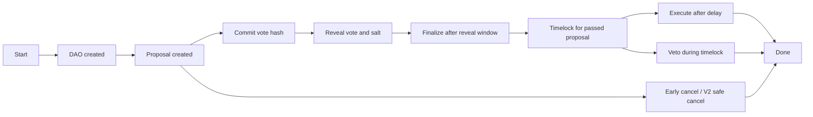

<!-- SPDX-License-Identifier: AGPL-3.0-or-later -->
# PrivateDAO

> **Open-source review notice:** PrivateDAO keeps its core source open for the hackathon, judging, security review, ecosystem diligence, and official collaboration. Source files under AGPL-3.0-or-later keep the rights and duties of that license. PrivateDAO brand identity, official deployments, product design, media, evidence packets, roadmap language, commercial service packaging, and Whitepaper material are reserved. Open-source forks must respect the applicable license and must not impersonate PrivateDAO, reuse official branding, commercialize PrivateDAO service packages, or present derivative deployments as official without written coordination. See [`NOTICE.md`](NOTICE.md) and [`TERMS_OF_REVIEW.md`](TERMS_OF_REVIEW.md).

<p align="center">
  <a href="https://privatedao.org/" target="_blank">
    
  </a>
</p>

<p align="center">
  <strong>Private coordination layer for DAOs with public verification on Solana.</strong>
</p>

Most DAO decisions happen in public before they are ready.

Vote counts, percentages, whale wallets, voter identity, payroll context, treasury intent, and internal review momentum can all influence people before the voting period ends. That creates pressure, strategic voting, leaked negotiations, exposed contributors, and decisions that look transparent but are not always independent.

PrivateDAO solves that by separating **private coordination** from **public accountability**.

During an active decision, PrivateDAO hides the signals that bias voters: vote counts, percentages, leading side, voter identity, voting intent, sensitive room notes, payout recipients, payroll details, and treasury preparation. After the decision ends, PrivateDAO reveals the final outcome, proof, receipt, audit trail, and execution reference so the organization can stay accountable.

PrivateDAO is a live Solana Testnet product for private DAO coordination with public verification. A normal visitor opens the browser, understands governance and treasury context, signs from a Solana Testnet wallet, votes without influence while it matters, protects confidential governance and treasury workflows with encryption boundaries, then verifies final outcomes and proofs when transparency counts.

The user-facing flow is intentionally simple:

```text
Connect -> Intelligence -> Private Vote -> Reveal -> Verify -> Execute
```

PrivateDAO is now organized around six product lines:

1. **Proof Workflows** - underwriting, compliance, grant review, vendor onboarding, and internal approvals where the process must be verifiable without exposing the private policy.
2. **Private Governance** - rooms, committees, DAO votes, board decisions, and community governance with private coordination during the decision and public proof after reveal.
3. **Treasury Coordination** - spending requests, treasury-token decisions, grant disbursements, payout review, and audit trails.
4. **Sealed Auctions** - private-room and public auctions where bid intent stays hidden until the reveal/proof phase.
5. **TxLINE Match Settlement** - World Cup prediction-market settlement powered by official TxLINE fixture data, private payout-policy proof, and Solana receipt verification.
6. **Runtime/API Infrastructure** - AWS read-node, public health APIs, Supabase-backed receipts, QuickNode-supported reads, and developer-facing verification endpoints.

The encryption and privacy posture is practical: commit/reveal voting protects intent during the vote, private rooms protect coordination before execution, encrypted metadata protects sensitive payroll and payout context, and proof reports make the final result verifiable after reveal. The product keeps cryptography behind the workflow instead of forcing normal users to understand provider names before they can act.

Under that simple flow, PrivateDAO owns governance, privacy, coordination, execution, and proof. Infrastructure and intelligence providers stay modular: QuickNode, Supabase, AWS, QVAC, GoldRush/Covalent, Jupiter, PUSD/AUDD, Torque, MagicBlock, Ika/Encrypt, REFHE, Cloak, Umbra-compatible payout boundaries, Streamflow-compatible vesting boundaries, Tokens-compatible asset context, and Pyth-compatible price context are provider rails inside the product path, not separate empty integrations.

The site is being de-duplicated around canonical execution routes so historical links stay alive as bridges instead of becoming empty or competing integration pages.

Primary routes:

- `/products/` - the six product lines and their user-facing entry points.
- `/value/` - why PrivateDAO exists: public accountability, private coordination, verifiable execution.
- `/try/` - shortest first-run product path for a normal visitor.
- `/judge/` - 3-minute reviewer hub with live tracks and proof entry points.
- `/judge-ai/` - AI-readable judge summary for automated reviewers and evaluation tools.
- `/proof/` - transparency reports, proof routes, operation receipts, and reviewer packets.
- `/govern/` - wallet-first DAO, proposal, commit/reveal, finalize, and execute flow.
- `/rooms/` - private and VIP coordination rooms with invite, proposal, vote, reveal, and proof export.
- `/intelligence/` - intelligence before signing without exposing hidden vote intent.
- `/treasury/` - treasury coordination, asset context, route review, and execution proof.
- `/txline-settlement/` - TxLINE World Cup match settlement product with demo video, official fixture story, private policy proof, and Solana receipt path.
- `/payroll/` - confidential payroll and payout review paths.
- `/android/` - mobile wallet-first access to the same product routes.
- `/services/` - service router for QVAC, GoldRush, Jupiter, PUSD, Torque, MagicBlock, Cloak, Umbra, Ika/Encrypt, REFHE, Zerion, and runtime infrastructure.
- `/documents/site-execution-route-inventory-2026-05-27/` - canonical route inventory used to prevent duplicate or empty integrations while historical links stay alive as bridges.

AI-readable evaluation layer:

- `/llms.txt` - primary LLM index for Gemini, Claude, GPT-style agents, Colosseum Copilot, and scrapers.
- `/ai.json` - machine-readable product, integration, route, and evidence manifest.
- `/evidence.json` - machine-readable evidence claims proving live website, repo, proof routes, Testnet evidence, QVAC runtime proof, and provider status.
- `/robots.txt` and `/sitemap.xml` - explicitly expose the AI-readable files, judge routes, proof routes, and core product routes.

Important: PrivateDAO is not a concept-only or mock-only submission. The live site, public GitHub repository, Testnet proof routes, runtime APIs, Android/web UX, and AI-readable manifests are public.


<p align="center">
  <a href="https://privatedao.org/"></a>
  <a href="https://github.com/X-PACT/PrivateDAO/actions/workflows/ci.yml"></a>
  <a href="docs/awards.md"></a>
  <a href="https://solscan.io/account/EP9xE8MJZ6FfyEwLqns6HDdUZBknEa7WGYs1Jzsecuva?cluster=testnet"></a>
  <a href="https://privatedao.org/trust/"></a>
  <a href="docs/pdao-token.md"></a>
  <a href="docs/security-hardening-v2.md"></a>
  <a href="docs/operational-evidence.generated.md"></a>
  <a href="docs/testnet-lifecycle-rehearsal-2026-05-07.md"></a>
  <a href="docs/squads-testnet-custody-transfer-2026-05-22.md"></a>
  <a href="docs/dao-treasury-authority-handoff-2026-05-23.md"></a>
  <a href="docs/solana-anonymous-governance-primitive.md"></a>
  <a href="docs/magicblock/private-payments.md"></a>
  <a href="docs/rpc-architecture.md"></a>
  <a href="https://api.privatedao.org/healthz"></a>
  <a href="https://api.privatedao.org/api/v1/qvac/runtime-proof"></a>
  <a href="https://privatedao.org/api-status/"></a>
  <a href="https://privatedao.org/services/cloak-private-settlement/"></a>
  <a href="https://privatedao.org/services/umbra-private-payments/"></a>
  <a href="https://privatedao.org/intelligence/"></a>
  <a href="docs/quicknode-stream-intelligence.md"></a>
  <a href="https://privatedao.org/services/zerion-agent-policy/"></a>
  <a href="https://privatedao.org/services/jupiter-treasury-route/"></a>
  <a href="https://privatedao.org/services/torque-growth-loop/"></a>
  <a href="https://privatedao.org/services/audd-stablecoin/"></a>
  <a href="https://privatedao.org/services/pusd-stablecoin/"></a>
  <a href="https://privatedao.org/services/encrypt-ika-operations/"></a>
  <a href="https://privatedao.org/services/runtime-infrastructure/"></a>
  <a href="https://privatedao.org/trust/#whitepaper"></a>
  <a href="NOTICE.md"></a>
  <a href="LICENSE"></a>
</p>

## Whitepaper And Review Rights

- Whitepaper: `https://privatedao.org/trust/#whitepaper`
- Downloadable whitepaper: `https://privatedao.org/assets/private-dao-founder-whiteprint.md`
- Legal notice: `https://privatedao.org/legal/`
- Repository notice: [`NOTICE.md`](NOTICE.md)
- Terms of public source review: [`TERMS_OF_REVIEW.md`](TERMS_OF_REVIEW.md)

PrivateDAO remains open source where the repository license applies because the hackathon, auditors, and ecosystem need verifiable evidence. The official product identity is separate: brand use, official-looking derivative deployments, commercial packaging, institutional pilots, or reuse of official evidence and service materials require formal coordination.

The Whitepaper is intentionally split into four layers:

- **Whitepaper:** technical architecture, encryption layers, QVAC/local intelligence, ZK direction, treasury logic, emergency continuity, and wallet-first execution.
- **Vision Paper:** founder philosophy, ecosystem mission, why privacy matters, and why blockchain should preserve more than financial transfers.
- **Roadmap:** Phase 1 core proof, Phase 2 encrypted customer infrastructure, Mainnet/security reviews, and Phase 3 cross-chain expansion.
- **Project Letter:** a quiet project signature on an ecosystem-first commitment: the delivered core was the hardest part, while the remaining protection matrices are designed to improve continuously.

### Ecosystem Message

This product was not built as a hackathon showcase. It was built to address real ecosystem pain points through operational infrastructure that organizations, DAOs, and AI-native systems can use in production. Support from trusted reviewers, ecosystem catalysts, and foundational supporters accelerates this mission and strengthens confidence in the next generation of Solana builders.

## Program ID Lineage

PrivateDAO preserves both the old Devnet proof path and the current Anchor 1.0.1 Testnet deployment as migration evidence:

| Stage | Program ID | Evidence |
| --- | --- | --- |
| Legacy Devnet baseline | `5AhUsbQ4mJ8Xh7QJEomuS85qGgmK9iNvFqzF669Y7Psx` | [`docs/live-proof.md`](docs/live-proof.md), [`docs/testnet-migration-report-2026-04-18.md`](docs/testnet-migration-report-2026-04-18.md) |
| Current Anchor 1.0.1 Testnet | `EP9xE8MJZ6FfyEwLqns6HDdUZBknEa7WGYs1Jzsecuva` | [`docs/anchor-1-migration-evidence-2026-04-30.md`](docs/anchor-1-migration-evidence-2026-04-30.md), [`docs/testnet-lifecycle-rehearsal-2026-05-07.md`](docs/testnet-lifecycle-rehearsal-2026-05-07.md) |

The program ID change is part of the documented Anchor 1.0.1 migration and clean Testnet deployment. It is preserved as provenance for reviewers, not treated as a loss of continuity.

## Custody And Anonymous Governance Update

- Testnet program upgrade authority is now controlled by a Squads 2-of-3 vault: [`docs/squads-testnet-custody-transfer-2026-05-22.md`](docs/squads-testnet-custody-transfer-2026-05-22.md).
- DAO operating authority and treasury operator authority handoffs are implemented in code through `transfer_dao_authority` and `transfer_treasury_operator_authority`; live activation requires the Squads-governed upgrade/timelock execution before any Testnet handoff signature is claimed: [`docs/dao-treasury-authority-handoff-2026-05-23.md`](docs/dao-treasury-authority-handoff-2026-05-23.md), [`scripts/execute-after-timelock.sh`](scripts/execute-after-timelock.sh).
- The ZK layer is now packaged as a Solana-native anonymous governance primitive with frozen membership snapshots, proposal-scoped nullifiers, and explicit tally modes: [`docs/solana-anonymous-governance-primitive.md`](docs/solana-anonymous-governance-primitive.md).

## Winner Signal

**Regional 1st Place recognition, March 2026.**

PrivateDAO engineering already carries a real first-place regional signal. That matters here because this repo is built the same way: live protocol code, live Testnet execution, explicit trust boundaries, and machine-checked reviewer evidence. See [`docs/awards.md`](docs/awards.md).

## Continuous Delivery Notice

Core development, wallet hardening, localization, and service packaging run in continuous release cycles.

Current web polish:

- The public site defaults to English unless a visitor explicitly selects another language or opens a `?lang=` link; stale browser language storage is cleared back to English for new review sessions.
- Legacy or mistyped routes render a reviewer-grade route recovery surface that preserves judging history and points to the closest live proof, QVAC, Cloak, trust, whitepaper, or services route.
- No submitted judging links are deleted during route maintenance; links are repaired, bridged, or recovered into the best live section.

If a route is being refreshed:

- retry in a few minutes
- check `https://privatedao.org/trust/`
- check `https://privatedao.org/community/`

PrivateDAO is live on Solana Testnet with the Anchor 1.0.1 program deployed, web and Android constants aligned, and the standard governance lifecycle preserved as reviewer-visible evidence.

## Track Delivery And Security Baseline

- Track-by-track delivery board and submission artifacts: [`submissions-new/TRACK_EXECUTION_BOARD.md`](submissions-new/TRACK_EXECUTION_BOARD.md)
- Submission index and publish log: [`submissions-new/README.md`](submissions-new/README.md)
- theMiracle wallet-placement benefit proposal: [`docs/themiracle-benefit-proposal.md`](docs/themiracle-benefit-proposal.md) and `https://privatedao.org/documents/themiracle-benefit-proposal/`
- theMiracle live benefit route: `https://privatedao.org/benefit/`
- Excellence closure matrix: [`docs/excellence-closure-matrix-2026-05-06.md`](docs/excellence-closure-matrix-2026-05-06.md) and `https://privatedao.org/documents/excellence-closure-matrix-2026-05-06/`
- Security baseline snapshot (current gate findings and mitigations): [`docs/security-baseline-2026-04-24.md`](docs/security-baseline-2026-04-24.md)

## What PrivateDAO Is Now

PrivateDAO is a wallet-first Solana Testnet financial OS for organizations that need private governance, confidential treasury execution, local-first intelligence, and reviewer-visible proof without forcing normal users into terminal workflows.

**Private. Verified. Informed.** PrivateDAO combines commit-reveal privacy, ZK review proofs, REFHE proof receipts, MagicBlock execution receipts, Ika readiness, Umbra payout lanes, QuickNode stream telemetry, and Covalent GoldRush intelligence into one governance OS where every decision is private, verified, and informed.

- **Private:** ZK proof rails, commit-reveal voting, Cloak settlement posture, and Umbra confidential payout lanes.
- **Verified:** fresh Testnet proof, V3 hardening, Anchor 1.0.1 toolchain evidence, Solscan-linked receipts, and Supabase timeline continuity.
- **Informed:** Covalent GoldRush, QVAC `qvac/fabric-llm-finetune`, SNS resolution, Zerion policy context, and the Intelligence layer before a user signs.
- **Track-closed:** the active Frontier matrix maps Encrypt/Ika, MagicBlock, Umbra, Jupiter, QuickNode, Solflare, Eitherway, intelligence, and capital-route lanes to routes, proof endpoints, and verification commands: [`docs/frontier-track-closure-matrix-2026-05-25.md`](docs/frontier-track-closure-matrix-2026-05-25.md).

The core product narrative is simple: PrivateDAO turns operations that used to require developers, command lines, custom scripts, and cryptography specialists into guided interface workflows. A user can learn the idea in `/learn`, connect a wallet, review the action in normal product language, sign the exact request, and verify the receipt from the web app or Android surface.

## Grand Champion Improvement Map

The active improvement plan is organized into ten execution levels:

| Level | Focus | Shortest surface |
| --- | --- | --- |
| 1 | First-minute understanding | `https://privatedao.org/start/` |
| 2 | Wallet-first execution | `https://privatedao.org/govern/` |
| 3 | Android parity | `https://privatedao.org/android/` |
| 4 | Proof continuity | `https://privatedao.org/proof/?judge=1` |
| 5 | Confidential operations | `https://privatedao.org/payroll/` |
| 6 | Intelligence before signing | `https://privatedao.org/intelligence/` |
| 7 | Business conversion | `https://privatedao.org/pricing/` |
| 8 | Security and release discipline | `https://privatedao.org/security/` |
| 9 | Repository reviewability | `README.md` and `scripts/` |
| 10 | Judging-grade narrative | `https://privatedao.org/judge/` |

Canonical map: [`docs/grand-champion-10-level-improvement-map-2026-05-22.md`](docs/grand-champion-10-level-improvement-map-2026-05-22.md).

## Business Model In One Minute

PrivateDAO is not only a technical privacy system. It has a buyer-readable commercial path tied to the live Testnet product:

| Layer | Buyer motion | Why it matters |
| --- | --- | --- |
| Open protocol | Free Testnet product access, source inspection, and proof review | Builds trust, adoption, and ecosystem review without hiding the protocol. |
| Fixed pilot | `$2,500 setup` for a four-week pilot around one governance, payout, payroll, or treasury workflow | Creates the first paid conversion with a measurable proof packet instead of a vague enterprise promise. |
| Managed operations | `$750/month` starting point after pilot validation | Turns repeated governance, payroll, payout, telemetry, hosted-read, and proof-export work into recurring revenue. |
| Sovereign deployment | Custom pricing for customer-cloud installs, dedicated controls, white-label posture, custom retention, and support | Captures high-value organizations that need dedicated infrastructure and stronger control boundaries. |

The commercial claim stays evidence-bound: the Testnet billing rehearsal proves wallet-signed payment logic and receipt continuity today; mainnet revenue, card subscription automation, and production custody remain release-stage targets rather than claimed facts.

The release discipline is also part of the product. Remaining external gates are not hidden as footnotes; they are exposed as operating lanes with routes, schemas, commands, and reviewer-readable boundaries. The current closure map is published in [`docs/excellence-closure-matrix-2026-05-06.md`](docs/excellence-closure-matrix-2026-05-06.md).

It combines:

- **Private voting:** commit-reveal governance with proposal-bound commitments.
- **Confidential treasury operations:** payroll, bonus, and payout flows with aggregate on-chain settlement state.
- **Local-first intelligence:** QVAC-positioned proposal context, translation, OCR, and operator guidance that keeps sensitive organizational data close to the user instead of routing it through a centralized AI workflow.
- **Execution safety:** timelocks, veto and cancel boundaries, duplicate-execution resistance, and strict treasury account validation.
- **Evidence and reviewability:** Anchor 1 Testnet deployment proof, Devnet rehearsals, Testnet lifecycle proof, ZK proof anchors, runtime packets, manifests, and generated audit surfaces.
- **Operational packaging:** Realms migration, hosted read/API packaging, trust exports, pilot material, and operator docs.

## Why It Matters To The Ecosystem

PrivateDAO is being built as public-good governance and treasury infrastructure for Solana.

The goal is not only to ship one strong product surface. The goal is to make advanced governance, privacy, telemetry, and treasury discipline easier for the ecosystem to adopt, inspect, and build on.

That matters because the same core system can serve:

- grant and allocation committees
- treasury and payout governance
- protocol operating councils
- security-sensitive decisions
- contributor, vendor, and payroll-style payout workflows

## Clear Product Roadmap

The roadmap is intentionally simple and fundable:

1. make the wallet-first Testnet flow effortless for first-time visitors
2. keep proof, telemetry, custody, and diagnostics attached to the same product corridor
3. strengthen audit, monitoring, signed wallet capture intake, and settlement publication
4. close the remaining production gates and ship the strongest possible release candidate

## What Is Live Now

PrivateDAO is already a live Solana Testnet governance infrastructure product, not a concept deck:

- Anchor 1.0.1 program deployed on Solana Testnet with active web, Android, IDL, README, and reviewer evidence aligned
- Devnet rehearsal history preserved as the transition evidence base
- Wallet-connected frontend
- Operational routes for onboarding, command, dashboard, proof, diagnostics, and services
- PDAO governance token surface
- Web wallet DAO bootstrap on Testnet
- Web wallet proposal submit on Testnet
- Repo-native and device-native proof paths for the broader governance lifecycle
- Confidential payout paths with `REFHE` and `MagicBlock` integration surfaces
- `Strict V2` hardening for proof, settlement, cancellation, and policy snapshots
- `Governance Hardening V3` for token-supply quorum snapshots and dedicated reveal rebate vaults
- `Settlement Hardening V3` for payout caps, evidence-aging windows, and explicit REFHE/MagicBlock execution requirements
- Backend read node and RPC Fast-oriented evidence path
- Testnet billing rehearsal route with wallet-signed on-chain service charge proof
- Standard Testnet lifecycle rehearsal with create DAO, proposal, commit, reveal, finalize, execute, and treasury delta verification
- Reviewer-facing runtime, security, launch packets, and Supabase receipt timeline rows from the latest Testnet rehearsal

## Product Surface Split

The public product UI is intentionally responsible for:

- Connect Wallet
- Create DAO on Testnet from the connected web wallet
- Create Proposal on Testnet from the connected web wallet after live DAO bootstrap
- Commit Vote
- Reveal Vote
- Finalize Proposal
- Execute Proposal
- View Logs
- Diagnostics

The public repo and CLI remain available for:

- Advanced debugging
- Batch operations
- Emergency recovery
- Migration tools
- Stress tests

This keeps the buyer-facing product clean while preserving engineering and protocol discipline in the repo.

## First-Visit Operating Lanes

The first product view exposes the highest-value lanes immediately so a judge, investor, user, or builder can start from the right surface without hunting through docs:

| Lane | Route | Why it matters |
| --- | --- | --- |
| Intelligence | `https://privatedao.org/intelligence/` | QVAC, Covalent GoldRush, SNS, Zerion policy context, counterparty trust, proposal context, and RPC quality before signing. |
| Decision Intelligence | `https://privatedao.org/services/goldrush-decision-intelligence/` | Direct provider-to-execution corridor: GoldRush wallet context, QVAC decision support, Encrypt/IKA handoff, wallet execution, and proof continuity. |
| Governance | `https://privatedao.org/govern/` | DAO creation, proposal creation, voting, reveal, finalize, and execution path. |
| Treasury | `https://privatedao.org/treasury/` | Treasury health, policy, solvency posture, and agent context. |
| Payroll | `https://privatedao.org/payroll/` | Private CSV payroll, stablecoin selection, Umbra/Cloak posture, and audit receipts. |
| Gaming | `https://privatedao.org/gaming/` | Guilds, tournaments, inventory proposals, and private reward operations. |
| Compliance | `https://privatedao.org/compliance/` | Scoped compliance packs, bounded viewing keys, and dWallet-signed evidence framing. |
| Benefit | `https://privatedao.org/benefit/` | theMiracle wallet-placement design, Founding Governor incentive, and conversion-ready CTA. |
| Proof | `https://privatedao.org/proof/` | Proof Matrix, Solscan links, ZK badges, viewing-key evidence, and judge mode. |
| Developers | `https://privatedao.org/developers/` | SDK/API surface, Anchor 1 evidence, privacy integration, and read-node entry points. |
| RPC Services | `https://privatedao.org/rpc-services/` | Hosted reads, relayer health, QVAC runtime proof, and backend evidence. |
| Command Center | `https://privatedao.org/command-center/` | Live ops dashboard, indexed proposal context, custody readiness, and execution gates. |

The public about route now carries the short executive narrative for reviewers and non-technical visitors:

- About: `https://privatedao.org/about/`
- Anchor 1 evidence: `https://privatedao.org/documents/anchor-1-migration-evidence-2026-04-30/`
- Live proof V3: `https://privatedao.org/documents/live-proof-v3/`
- ZK capability matrix: `https://privatedao.org/documents/zk-capability-matrix/`

## Technology Map

PrivateDAO keeps each integration tied to a user-facing job. The product does not show sponsor logos as decoration; each rail either helps the user review, sign, execute, settle, or verify an operation.

| Icon | Technology | Where it appears | How PrivateDAO uses it |
| --- | --- | --- | --- |
| ⚓ | Anchor 1.0.1 | `/govern`, `/proof`, program docs | Current Solana Testnet governance program: DAO creation, proposals, commit/reveal voting, finalization, execution, and reviewer-visible account state. |
| 🟣 | QVAC `qvac/fabric-llm-finetune` | `/services/qvac-sovereign-ai`, `/intelligence`, `/assistant` | Sensitive-decision AI before signing: private payroll, treasury, compliance, and high-value vote context stays local instead of going to a centralized model endpoint. |
| 🧠 | OpenRouter-ready assistant | `/assistant`, `/search` | Optional live product guide for demos. It converts a user problem into the right route and proof path; keys stay in the browser session, not the repo. |
| 🔐 | ZK proof rails | `/proof`, `/security`, `/documents/zk-capability-matrix` | Shows when an action has proof anchors, privacy badges, and reviewer evidence without exposing private voting or payout intent. |
| 🧮 | REFHE / Encrypt / IKA | `/services/encrypt-ika-operations`, `/treasury`, `/documents/testnet-refhe-encrypt-ika-commitment-2026-05-07` | Proposal-bound confidential execution metadata, encrypted hashes, verifier-program binding, and fresh Testnet REFHE settlement evidence. |
| ⚡ | MagicBlock | `/services/main-frontier-closure`, MagicBlock docs | Private-payment and fast execution corridor for confidential payout stories after governance approval. |
| 🌑 | Umbra / Cloak | `/services/cloak-private-settlement`, `/payroll`, `/proof` | Private settlement intent, relayer readiness, scoped viewing-key posture, and audit-friendly confidential payout flows. |
| 🔁 | Jupiter | `/services/jupiter-treasury-route`, `/treasury` | No-key quote preview for governed treasury routes so operators can review output, slippage, and route rationale before execution. |
| 📊 | GoldRush / Dune | `/intelligence`, `/treasury`, `/documents/testnet-integration-runtime-closure-2026-05-07` | Prominent financial intelligence before signing: wallet history, stablecoin flow, counterparty trust, suspicious flows, and proposal review. |
| 📡 | QuickNode Streams | `/intelligence`, `/proof`, `/documents/quicknode-stream-intelligence` | Protected Solana Testnet stream intake for block/program-log telemetry, proof freshness, compute usage, and runtime evidence before QVAC turns it into signer-readable decision support. |
| 🏆 | Torque | `/services/torque-growth-loop`, `/proof` | Governance participation and receipt events for growth loops, rewards, and reviewer-visible engagement telemetry. |
| 🤖 | Zerion agent policy | `/services/zerion-agent-policy`, `/treasury` | Bounded treasury assistant policy: allowed pairs, spend caps, and governance-controlled rebalancing context. |
| 🧾 | Supabase | `/proof`, `/live`, `/dashboard` | Browser-direct receipt timeline for confirmed operations, avoiding static-export API limitations while keeping proof visible. |
| 🧭 | Eitherway | `/services/eitherway-live-dapp`, `/dashboard` | Wallet-first dApp lane for profile signing, partner route selection, Supabase receipt continuity, and judge-ready live app review. |
| ☁️ | AWS read node | `api.privatedao.org`, `/rpc-services` | Hosted read-node and relayer health surface for indexed evidence, QVAC runtime proof, and infrastructure checks. |
| 🔎 | SNS `.sol` lookup | `/execute`, `/services`, wallet helpers | Lets users resolve readable `.sol` names instead of pasting raw wallet addresses where supported. |
| 📱 | Android | `/android`, mobile docs | Mobile parity for the same wallet-first operating story: learn, review, sign, and verify without terminal workflows. |

## Provider To Encrypted Execution Spine

PrivateDAO now has a direct route for the highest-value operating question: how does provider intelligence become a protected on-chain action?

Route: `https://privatedao.org/services/goldrush-decision-intelligence/`

| Stage | Route | User job |
| --- | --- | --- |
| Provider | `/services/goldrush-decision-intelligence` | Run GoldRush-style wallet, stablecoin, counterparty, and source-health review. |
| Decide | `/intelligence` | Use QVAC and deterministic analysis to classify risk before signing. |
| Encrypt | `/services/encrypt-ika-operations` | Prepare REFHE packets, encrypted manifests, IKA custody routes, and commitment-safe artifacts. |
| Execute | `/execute` | Sign only after the decision and privacy boundary are clear. |
| Verify | `/proof` | Inspect receipts, logs, documents, and chain evidence without exposing confidential payloads. |

This is not a sponsor-logo collage. It is the product architecture: analyze the counterparty, decide what risk exists, encrypt what must stay private, sign only from the wallet, and verify the outcome.

## Anchor 1.0.1 Toolchain Status

PrivateDAO has been upgraded at the Solana program layer to Anchor `1.0.1`.

| Layer | Current value | Evidence |
| --- | --- | --- |
| Local Anchor CLI | `anchor-cli 1.0.1` | `anchor --version` on the current build host |
| `Anchor.toml` | `anchor_version = "1.0.1"` | [`Anchor.toml`](Anchor.toml) |
| Rust program crates | `anchor-lang = "1.0.1"`, `anchor-spl = "1.0.1"` | [`Cargo.toml`](Cargo.toml), [`Cargo.lock`](Cargo.lock) |
| Deployed Testnet program | `EP9xE8MJZ6FfyEwLqns6HDdUZBknEa7WGYs1Jzsecuva` | [`docs/anchor-1-migration-evidence-2026-04-30.md`](docs/anchor-1-migration-evidence-2026-04-30.md) |
| TypeScript Anchor client | `@coral-xyz/anchor@0.32.1` | npm latest is still `0.32.1`, so the web client stays on the latest published npm package instead of pretending a `1.0.1` npm client exists. |

This is the exact reviewer boundary: Anchor Rust program/toolchain is on `1.0.1`; the TypeScript client uses the latest package currently published to npm.

## QVAC Integration

PrivateDAO uses the official QVAC model `qvac/fabric-llm-finetune` as the local sovereign AI path for proposal and treasury briefs.

- Route: `https://privatedao.org/services/qvac-sovereign-ai/`
- Product use: local execution brief for DAO proposals, private treasury movement, counterparty review, and privacy-mode recommendation before signing.
- SDK proof: `npm run probe:qvac-runtime` imports `@qvac/sdk`, records SDK version `0.10.0`, and publishes the runtime proof through `https://api.privatedao.org/api/v1/qvac/runtime-proof`.
- Runtime: browser-side Transformers.js using `@xenova/transformers`, with browser cache enabled after first model load.
- Capability surface: the runtime proof verifies QVAC SDK exports used by the product lane, including `loadModel`, `completion`, `embed`, `translate`, `transcribe`, and `ocr`.
- Privacy posture: no API key, no centralized model endpoint, no wallet intent sent to a hosted LLM.
- Fallback boundary: if a device cannot load the model, the page falls back to deterministic local policy analysis and labels that state explicitly.

The QVAC lane is core product functionality, not a wrapper demo: it sits in the pre-sign review path used by `/intelligence/`, `/execute/`, and `/services/qvac-sovereign-ai/`.

## Fresh Testnet Cryptographic Evidence

These packets are the shortest judge path for the cryptography-heavy layers:

| Layer | Product role | Fresh proof |
| --- | --- | --- |
| REFHE / Encrypt / IKA | Confidential execution commitments and verifier-program binding for sensitive treasury metadata. | [`docs/testnet-refhe-encrypt-ika-commitment-2026-05-07.md`](docs/testnet-refhe-encrypt-ika-commitment-2026-05-07.md) |
| ZK proof continuity | Proof badges for hidden vote, delegation, and tally layers without exposing the underlying intent. | [`docs/testnet-zk-verification-receipts-2026-05-07.md`](docs/testnet-zk-verification-receipts-2026-05-07.md) |
| Umbra / Cloak | Private settlement lanes with relayer readiness and browser-direct receipt continuity. | [`docs/testnet-integration-runtime-closure-2026-05-07.md`](docs/testnet-integration-runtime-closure-2026-05-07.md) |
| Umbra intent boundary | Stealth-settlement intent, recipient hash posture, relayer readiness, and full SDK/UTXO claim boundary. | [`docs/umbra-intent-evidence-2026-05-07.md`](docs/umbra-intent-evidence-2026-05-07.md) |
| GoldRush / Dune / Zerion / MagicBlock / QVAC | Live hosted checks from `api.privatedao.org` for intelligence, policy, relayer, and runtime status. | [`docs/testnet-integration-runtime-closure-2026-05-07.md`](docs/testnet-integration-runtime-closure-2026-05-07.md) |

Normal users see simple route names: `Review with QVAC`, `Check wallet with GoldRush`, `Prepare private settlement`, and `Verify proof`. Judges get direct Solana Testnet transaction links and JSON/Markdown evidence packets.

### Cloak SDK Devnet Probe

PrivateDAO now carries an explicit Cloak SDK probe for the official devnet package:

- SDK: `@cloak.dev/sdk-devnet`
- Probe: `npm run probe:cloak-devnet-sdk`
- Packet: [`docs/cloak-devnet-sdk-live-probe.generated.md`](docs/cloak-devnet-sdk-live-probe.generated.md)
- JSON: [`docs/generated/cloak-devnet-sdk-probe.generated.json`](docs/generated/cloak-devnet-sdk-probe.generated.json)

The default probe checks the official Cloak docs index, exported UTXO SDK contract, devnet relay health, executable devnet program account, and the hosted PrivateDAO read-node intent receipt. A funded live devnet deposit is opt-in via `PRIVATE_DAO_CLOAK_E2E=1 npm run probe:cloak-devnet-sdk`; the probe never prints private keys, viewing keys, UTXO private keys, seed material, or raw note payloads.

## Replay Pressure Note

Reviewer telemetry may show replay pressure or extra attempts. That is expected evidence from adversarial and retry-path testing, not hidden product failure. The repo records replay pressure so judges can see that PrivateDAO tests duplicate execution, retry behavior, and evidence aging instead of presenting only happy-path screenshots.

## Normal User Browser Run

The non-terminal path is now explicit:

1. Open [`https://privatedao.org/start/`](https://privatedao.org/start/).
2. Connect a Testnet wallet. Solflare, Phantom, Glow, Backpack, and Wallet Standard wallets are surfaced from the browser product.
3. Continue to [`https://privatedao.org/govern/`](https://privatedao.org/govern/) and run the flow: create DAO, create proposal, commit, reveal, finalize, and execute.
4. Open [`https://privatedao.org/proof/?judge=1`](https://privatedao.org/proof/?judge=1) and [`docs/testnet-lifecycle-rehearsal-2026-05-07.md`](docs/testnet-lifecycle-rehearsal-2026-05-07.md) to verify the public signatures, accounts, treasury delta, Supabase receipt intake, and explorer links.
5. Use [`https://privatedao.org/learn/`](https://privatedao.org/learn/) for the lecture, code, quiz, and assignment corridor that explains what the user just executed.

Repo scripts remain the reproducible reviewer path, but the ordinary product path is browser-first: click, sign, run, verify.

Current web/runtime boundary:

- `Create DAO` now has a live wallet-first Testnet bootstrap path in the web action workbench.
- `Create Proposal` now has a live wallet-first Testnet submit path in the same workbench once a live DAO bootstrap has already established the DAO lane, including the current live `SendSol` and `SendToken` treasury-motion lanes.
- `Commit Vote`, `Reveal Vote`, and `Finalize Proposal` now use the same live wallet-first workbench lane once a real DAO and proposal already exist in session state.
- `Execute Proposal` now also has a live wallet-first path for standard proposals and the current live `SendSol` and `SendToken` treasury-motion lanes.
- Repo-script lifecycle proof, browser-wallet execution proof, Android Solflare mobile capture, and standard Testnet lifecycle proof are now recorded as separate evidence packets.
- `CustomCPI` still requires the richer payout path; the current live web builder now carries the supported treasury transfer variants, but it does not claim arbitrary treasury action coverage.

The rule is strict:

- If a normal user needs it, it belongs in the UI.
- If it is for protocol maintenance, incident handling, migrations, or engineering-only control, it belongs in the public repo and CLI.

## Current Product Cycle

PrivateDAO is actively being advanced as a live Testnet product under continuous community review.

The public message stays simple:

- one coherent governance product
- private and confidential treasury operations
- clear runtime evidence and trust surfaces
- stronger operator and reviewer readability with each shipping tranche

## Launch Boundary

PrivateDAO is already strong enough for Testnet evaluation, judge review, and pilot packaging, and the current execution strategy is designed to convert that foundation into mainnet-grade readiness with the right support and closure evidence:

| Stage | Current status | Evidence |
| --- | --- | --- |
| Product and protocol | Live on Solana Testnet with browser product surfaces and reviewer proof | Live frontend, Anchor program, PDAO governance mint, commit-reveal lifecycle, confidential payout flows, Strict V2 hardening. |
| Reviewer evidence | Implemented and generated | 50-wallet Devnet rehearsal, fresh 2026-05-07 Testnet lifecycle proof, Supabase receipt rows, Android Solflare capture, ZK anchors, operational evidence, audit packet, cryptographic manifest, and `npm run verify:all`. |
| Launch operations | Repo-defined and ready for closure | Multisig intake, authority transfer runbook, launch ops checklist, monitoring rules, wallet E2E plan. |
| Production custody | Structured for execution with recorded evidence next | 2-of-3 multisig, 48+ hour timelock, authority transfer signatures, signer backups, and post-transfer authority readouts. |
| Mainnet real funds | Final production gate | External audit, live monitoring, real-device captures, source-verifiable MagicBlock/REFHE receipts, and final cutover ceremony. |

Operational launch docs:

- [`docs/mainnet-blockers.md`](docs/mainnet-blockers.md)
- [`docs/multisig-setup-intake.md`](docs/multisig-setup-intake.md)
- [`docs/authority-transfer-runbook.md`](docs/authority-transfer-runbook.md)
- [`docs/launch-ops-checklist.md`](docs/launch-ops-checklist.md)
- [`docs/monitoring-alert-rules.md`](docs/monitoring-alert-rules.md)
- [`docs/wallet-e2e-test-plan.md`](docs/wallet-e2e-test-plan.md)
- [`docs/launch-trust-packet.generated.md`](docs/launch-trust-packet.generated.md)
- [`docs/final-closure-workplan-2026-04-19.md`](docs/final-closure-workplan-2026-04-19.md)
- [`docs/track-funding-integration-closure-plan-2026-04-19.md`](docs/track-funding-integration-closure-plan-2026-04-19.md)
- [`docs/production-custody-ceremony.md`](docs/production-custody-ceremony.md)
- [`docs/external-audit-engagement.md`](docs/external-audit-engagement.md)
- [`docs/pilot-onboarding-playbook.md`](docs/pilot-onboarding-playbook.md)
- [`docs/browser-automation-audit.md`](docs/browser-automation-audit.md)
- [`docs/security-audit-remediation-2026-04-08.md`](docs/security-audit-remediation-2026-04-08.md)

The README should stay aligned with this rule: implemented surfaces are described as implemented; external launch steps are described as pending until real evidence is recorded.

## Canonical Custody Proof

The canonical custody source of truth is:

- [`docs/multisig-setup-intake.json`](docs/multisig-setup-intake.json)
- [`docs/custody-observed-readouts.json`](docs/custody-observed-readouts.json)
- [`docs/canonical-custody-proof.generated.md`](docs/canonical-custody-proof.generated.md)
- [`docs/custody-proof-reviewer-packet.generated.md`](docs/custody-proof-reviewer-packet.generated.md)
- [`docs/production-custody-ceremony.md`](docs/production-custody-ceremony.md)
- [`docs/authority-transfer-runbook.md`](docs/authority-transfer-runbook.md)
- [`docs/mainnet-blockers.md`](docs/mainnet-blockers.md)

Strict operator ingestion path:

1. Build the packet in `https://privatedao.org/custody/`
2. Save it locally as `docs/custody-evidence-intake.json`
3. Run `npm run apply:custody-evidence-intake`

Current official custody state from the canonical intake:

- status: `ready-for-transfer`
- production mainnet claim allowed: `false`
- network: `testnet`
- threshold target: `2-of-3`
- signer public keys recorded: `3/3`
- multisig implementation: `Squads Protocol`
- multisig address: `thHmF7VYNtxE1MaDzYXbfPCiq13RF6JwuWnjvDZuSmF`
- vault authority: `CALHrBqx6jbzcPn2NVcinqSAHeod65v9LcDuTxsdPqBv`
- timelock configuration evidence: `67S63JAUNvvCED3hE9h6bCXW9iJ3EYzJLARvj8Lki5x2dJEgLnrfES9mp6bAxfsH6vfmor2ocqNaEd68uVN68DNJ`
- program-upgrade authority transfer: `EzwLLrAchBpj3eLTUFuv1uo9rSLKgKNbQgp1DkCevJycT31Eou9TSJsJsEfMjLt4q87pKwXaZUTqCZ1NduNc1vy`
- current Testnet program authority readout: `CALHrBqx6jbzcPn2NVcinqSAHeod65v9LcDuTxsdPqBv`
- DAO authority transfer: pending Squads-governed timelock execution of the upgraded instruction
- treasury operator authority transfer: pending Squads-governed timelock execution of the upgraded instruction

Live proof surface:

- `https://privatedao.org/custody/`
- `https://privatedao.org/documents/`
- `https://privatedao.org/documents/canonical-custody-proof/`
- `https://privatedao.org/documents/custody-proof-reviewer-packet/`
- `https://privatedao.org/documents/launch-trust-packet/`
- `https://privatedao.org/documents/mainnet-blockers/`

This is intentional: the product now exposes the exact custody proof shape and the live operating milestones around it, while the transfer ceremony keeps moving toward a reviewer-ready closeout with real addresses, signatures, explorer links, and readouts. The goal is not to overstate readiness. The goal is to keep making the system stronger, more credible, and more defensible with every serious execution tranche.

## Start Here

| If you need | Link |
| --- | --- |
| Live product | https://privatedao.org/ |
| Command center | https://privatedao.org/command-center/ |
| Governance dashboard | https://privatedao.org/dashboard/ |
| Custody workspace | https://privatedao.org/custody/ |
| Launch trust packet | https://privatedao.org/documents/launch-trust-packet/ |
| Reviewer telemetry packet | https://privatedao.org/documents/reviewer-telemetry-packet/ |
| Mainnet blockers | https://privatedao.org/documents/mainnet-blockers/ |
| Story video | https://privatedao.org/story/ |
| Technology explainer video | https://youtu.be/iFTUe4CTWP0 |
| Community | https://privatedao.org/community/ |
| Judge / proof view | https://privatedao.org/proof/?judge=1 |
| Wallet diagnostics | https://privatedao.org/diagnostics/ |
| Services and buyer path | https://privatedao.org/services/ |
| Treasury receive surface | https://privatedao.org/services/ |
| Lifecycle product video | https://privatedao.org/assets/private-dao-demo-flow.mp4 |
| Testnet program | https://solscan.io/account/EP9xE8MJZ6FfyEwLqns6HDdUZBknEa7WGYs1Jzsecuva?cluster=testnet |
| Testnet lifecycle proof | [`docs/testnet-lifecycle-rehearsal-2026-05-07.md`](docs/testnet-lifecycle-rehearsal-2026-05-07.md) |
| Final closure workplan | [`docs/final-closure-workplan-2026-04-19.md`](docs/final-closure-workplan-2026-04-19.md) |
| Canonical custody intake | [`docs/multisig-setup-intake.json`](docs/multisig-setup-intake.json) |

The launch boundary is now surfaced in-product through `https://privatedao.org/custody/`, where multisig creation, authority transfer, and evidence requirements are shown as a live operating workflow rather than a hidden note.

## Reviewer Surfaces

PrivateDAO is presented publicly as one coherent product with multiple reviewer-visible lanes.

| Reviewer lane | Live route | Strongest visible fit |
| --- | --- | --- |
| Primary product lane | https://privatedao.org/learn/ | Product shell, trust surfaces, proof continuity, and buyer path |
| Confidential operations lane | https://privatedao.org/security/ | Commit-reveal governance, privacy-aware treasury motion, and settlement posture |
| Runtime and infrastructure lane | https://privatedao.org/analytics/ | Hosted reads, diagnostics, API packaging, and runtime evidence |

The operating rule stays strict:

- one product thesis
- multiple reviewer corridors under the same product narrative
- no contradiction between site, README, deck, product walkthrough, or proof

## External Review Corridors

Beyond the main product route, PrivateDAO is also packaged through adjacent reviewer and buyer corridors that strengthen the same commercial product thesis instead of fragmenting it.

| Corridor | Current strongest route | What it proves now |
| --- | --- | --- |
| Startup capital corridor | `https://privatedao.org/start/` -> `https://privatedao.org/story/` -> `https://privatedao.org/services/` | Startup-quality product shell, buyer corridor, and reviewer-safe trust packaging |
| Regional grant corridor | `https://privatedao.org/awards/` -> `https://privatedao.org/learn/` | Ecosystem credibility, product maturity, and proof continuity |
| Data and telemetry corridor | `https://privatedao.org/diagnostics/` -> `https://privatedao.org/analytics/` | Runtime evidence, indexed proposal state, and hosted-read credibility |
| Confidential payout corridor | `https://privatedao.org/security/` -> `https://privatedao.org/services/` -> `https://privatedao.org/custody/` | Private treasury approvals, encrypted operations framing, and custody-aware payout discipline |
| Audit and hardening corridor | `https://privatedao.org/documents/canonical-custody-proof/` -> `https://privatedao.org/diagnostics/` | Canonical custody truth, authority hardening, and incident-readiness posture |

Canonical strategic reference:

- [`docs/strategic-opportunity-readiness-2026.md`](docs/strategic-opportunity-readiness-2026.md)
- [`docs/reviewer-telemetry-packet.generated.md`](docs/reviewer-telemetry-packet.generated.md)
- [`docs/ecosystem-focus-alignment.generated.md`](docs/ecosystem-focus-alignment.generated.md)

## Ecosystem Focus Alignment

The current ecosystem-facing fit is documented in:

- [`docs/ecosystem-focus-alignment.generated.md`](docs/ecosystem-focus-alignment.generated.md)

This packet keeps the case disciplined across:

- decentralisation
- censorship resistance
- DAO tooling
- education
- developer tooling
- payments
- selective cause-driven fit

The rule remains strict: only corridors already visible in the live product are presented as shipped, and every area keeps an explicit next gap instead of inflated claims.

## Story And Community

These are the public-facing routes reviewers, users, and buyers should see first:

| Surface | Link |
| --- | --- |
| Story video route | https://privatedao.org/story/ |
| Technology explainer video | https://youtu.be/iFTUe4CTWP0 |
| Weekly / public YouTube | https://www.youtube.com/@privatedao |
| Official Discord | https://discord.gg/PbM8BC2A |
| Public project profile | https://arena.colosseum.org/projects/explore/praivatedao |
| Guided product flow | [`docs/product-guided-flow.md`](docs/product-guided-flow.md) |
| Live proof V3 | [`docs/test-wallet-live-proof-v3.generated.md`](docs/test-wallet-live-proof-v3.generated.md) |
| Domain mirror plan | [`docs/domain-mirror.md`](docs/domain-mirror.md) |
| `.xyz` mirror checklist | [`docs/xyz-mirror-cutover-checklist.md`](docs/xyz-mirror-cutover-checklist.md) |
| Audit packet | [`docs/audit-packet.generated.md`](docs/audit-packet.generated.md) |
| Operational evidence | [`docs/operational-evidence.generated.md`](docs/operational-evidence.generated.md) |
| Integration evidence | [`docs/integration-evidence.generated.md`](docs/integration-evidence.generated.md) |
| Reviewer telemetry packet | [`docs/reviewer-telemetry-packet.generated.md`](docs/reviewer-telemetry-packet.generated.md) |
| Mainnet blockers | [`docs/mainnet-blockers.md`](docs/mainnet-blockers.md) |
| Trust package | [`docs/trust-package.md`](docs/trust-package.md) |
| Service catalog | [`docs/service-catalog.md`](docs/service-catalog.md) |
| Investor / reviewer pitch deck | [`docs/investor-pitch-deck.md`](docs/investor-pitch-deck.md) |

## System Diagram



## Governance Lifecycle



## Treasury Receive Configuration

The frontend can expose public treasury intake rails for:

- `SOL`
- `USDC`
- `USDG`

These are configured through public environment variables only:

- `NEXT_PUBLIC_TREASURY_RECEIVE_ADDRESS`
- `NEXT_PUBLIC_TREASURY_SOL_RECEIVE_ADDRESS`
- `NEXT_PUBLIC_TREASURY_USDC_RECEIVE_ADDRESS`
- `NEXT_PUBLIC_TREASURY_USDG_RECEIVE_ADDRESS`
- `NEXT_PUBLIC_TREASURY_USDC_MINT`
- `NEXT_PUBLIC_TREASURY_USDG_MINT`
- `NEXT_PUBLIC_TREASURY_NETWORK`

Use only public receive addresses here. Do not place signer keypairs, seed phrases, or treasury secrets in the frontend or this repository.

## Supabase Operation Timeline Setup

`/proof` now includes a live operation timeline backed by Supabase tables `public.operation_receipts` and `public.governance_receipts`.

1. Set public env values in `.env.local`:
   - `NEXT_PUBLIC_SUPABASE_URL`
   - `NEXT_PUBLIC_SUPABASE_PUBLISHABLE_KEY`
2. Open Supabase SQL editor and run:
   - [`docs/supabase-operation-receipts.sql`](docs/supabase-operation-receipts.sql)
3. Run the normal flow in `/govern` (create, commit, reveal, finalize, execute) or `/execute` billing rehearsal, then open `/proof` to confirm receipt rows.
4. The browser writes receipts directly to Supabase after confirmed wallet signatures. This avoids static-export API-route limitations and lets the proof timeline update through Supabase realtime.

The 2026-05-06 Testnet rehearsal inserted real receipt rows into both `governance_receipts` and `operation_receipts`. The timeline remains non-blocking: on-chain actions still run even if Supabase is not configured, and recent browser receipts are shown as local fallback.

## Telegram Operator Notifications

The AWS read-node can notify the operator when a visitor opens the site, submits an onboarding request, or signs a Testnet transaction from the interface.

Set one of these configurations on the AWS host, never in frontend code:

- Generic webhook: `PRIVATE_DAO_TELEGRAM_WEBHOOK_URL`, accepting a JSON body shaped as `{ "text": "..." }`.
- Telegram Bot API: `PRIVATE_DAO_TELEGRAM_BOT_TOKEN` and `PRIVATE_DAO_TELEGRAM_CHAT_ID`.

Visitor notifications are privacy-preserving. They include page, timestamp, country hint when supplied by the edge, and a short hash of the browser session. They do not store or send IP addresses. To reduce spam, normal visit notifications are throttled by:

- `PRIVATE_DAO_TELEGRAM_VISITOR_NOTIFICATIONS=true`
- `PRIVATE_DAO_TELEGRAM_VISITOR_MIN_INTERVAL_MS=60000`
- `PRIVATE_DAO_TELEGRAM_VISITOR_SESSION_TTL_MS=1800000`

## Umbra / Cloak Settlement Boundary

The hosted read node at `https://api.privatedao.org` now exposes reviewer-verifiable Umbra Devnet relayer readiness and Cloak-labelled private-settlement intent receipts:

- Health: `https://api.privatedao.org/api/v1/umbra/relayer/health`
- Info: `https://api.privatedao.org/api/v1/umbra/relayer/info`
- Private settlement intent receipt: `POST https://api.privatedao.org/api/v1/private-settlement/intent`
- Cloak devnet SDK probe: `npm run probe:cloak-devnet-sdk`

Current boundary: PrivateDAO verifies relayer health, supported mints, the Cloak devnet SDK contract, the Cloak devnet program account, and testnet settlement intent receipts. It does not fabricate a full Umbra claim. A full Umbra claim still requires SDK-generated ZK `proof_account_data` and UTXO slot data produced by the Umbra SDK path. A funded Cloak devnet UTXO deposit is available as an opt-in live probe because it creates a real devnet transaction.

## Read-Node Program Alignment Gate

The public frontend is intentionally static and resilient at `https://privatedao.org`, while the hosted read-node lane lives at `https://api.privatedao.org`.

The read node must report the current Anchor 1.0.1 Testnet program before it is treated as aligned:

- Expected program: `EP9xE8MJZ6FfyEwLqns6HDdUZBknEa7WGYs1Jzsecuva`
- Verification command: `npm run verify:remote-primary-host -- https://api.privatedao.org`
- EC2 repair command: `scripts/fix-primary-host-program-alignment.sh`
- Operator runbook: [`docs/read-node/aws-namecheap-cutover-2026-04-29.md`](docs/read-node/aws-namecheap-cutover-2026-04-29.md)

This gate prevents a healthy-looking API from silently serving stale program metadata after an AWS or DNS cutover.

## Feature Map

| Layer | What exists now | Key references |
| --- | --- | --- |
| Governance core | DAO creation, proposal creation, commit, reveal, finalize, execute, veto, cancel, delegation, keeper reveal. | [`programs/private-dao/src/lib.rs`](programs/private-dao/src/lib.rs), [`tests/private-dao.ts`](tests/private-dao.ts) |
| Treasury execution | SOL and Token-2022/SPL treasury paths with recipient, mint, owner, and duplicate-execution checks. | [`docs/security-review.md`](docs/security-review.md), [`docs/failure-modes.md`](docs/failure-modes.md) |
| Confidential payouts | Proposal-bound payroll and bonus plans with encrypted manifests and aggregate settlement. | [`docs/confidential-payments.md`](docs/confidential-payments.md), [`docs/confidential-payroll-flow.md`](docs/confidential-payroll-flow.md) |
| Confidential Treasury Command Center | Live guided UI path that turns `Create -> Commit -> Reveal -> Execute` into one product flow, then explains proposal-by-proposal whether ZK, REFHE, MagicBlock, and backend-indexed RPC are active, optional, or not required. The builder now includes smart presets for standard treasury grants, confidential payroll, confidential bonus, and private token distribution. | [`apps/web`](apps/web), [`docs/frontier-guided-flow.md`](docs/frontier-guided-flow.md) |
| Checkout-like onboarding rail | The proposals page now starts with a storefront-style onboarding rail that walks normal users through product pack selection, DAO bootstrap, treasury funding, proposal launch, and private vote/execute flow before they reach the lower-level consoles. The storefront now personalizes hero CTAs and compare cards based on the selected operating pack. | [`apps/web`](apps/web) |
| Storefront and service entry | The first product view now exposes product packs, Realms migration as a first-class entry, and a service catalog for hosted API, review exports, onboarding, and pilot support without pretending a self-serve SaaS checkout already exists. | [`apps/web`](apps/web), [`docs/service-catalog.md`](docs/service-catalog.md), [`docs/migration-story.md`](docs/migration-story.md) |
| Commercial buyer surface | The first product view now also frames the commercial buying path directly in-product: pilot package, hosted read API + ops, confidential operations premium, and enterprise governance retainer, each linked to the exact pricing, SLA, trust, and onboarding documents behind it. | [`apps/web`](apps/web), [`docs/pricing-model.md`](docs/pricing-model.md), [`docs/pilot-program.md`](docs/pilot-program.md), [`docs/service-level-agreement.md`](docs/service-level-agreement.md) |
| Buyer journey narrative | The first product view now explains who should buy PrivateDAO, why it exists beyond Realms or Squads alone, what happens in the first 30 days of a pilot, and what is live now versus still pending-external for real-funds launch. | [`apps/web`](apps/web), [`docs/trust-package.md`](docs/trust-package.md), [`docs/mainnet-blockers.md`](docs/mainnet-blockers.md), [`docs/pilot-program.md`](docs/pilot-program.md) |
| Conversion-ready pilot rail | The first product view now includes a commercial checkout rail for weeks 1-4 of a pilot plus a `Request Pilot Packet` action that copies the exact buyer-facing packet from the current repo truth surface. | [`apps/web`](apps/web), [`docs/pilot-program.md`](docs/pilot-program.md), [`docs/pricing-model.md`](docs/pricing-model.md), [`docs/trust-package.md`](docs/trust-package.md) |
| Product-proof hero strip | The hero now includes quick-switches for judge, buyer, and operator views plus a prominent live-success proof strip that surfaces Testnet lifecycle proof, V3 hardening packets, reviewer packets, and the explicit mainnet boundary from the first screen. | [`apps/web`](apps/web), [`docs/testnet-lifecycle-rehearsal-2026-04-19.md`](docs/testnet-lifecycle-rehearsal-2026-04-19.md), [`docs/test-wallet-live-proof-v3.generated.md`](docs/test-wallet-live-proof-v3.generated.md), [`docs/operational-evidence.generated.md`](docs/operational-evidence.generated.md), [`docs/mainnet-blockers.md`](docs/mainnet-blockers.md) |
| Persona-adaptive landing surface | The hero now shifts between buyer, judge, and operator narratives without changing the underlying proof links, and the proposals page now carries a sticky pack summary that turns the active preset into a clear operator and buyer brief. | [`apps/web`](apps/web), [`docs/grant-committee-pack.md`](docs/grant-committee-pack.md), [`docs/fund-governance-pack.md`](docs/fund-governance-pack.md), [`docs/enterprise-dao-pack.md`](docs/enterprise-dao-pack.md) |
| Commercial decision surface | The proposals page now includes a dedicated conversion layer: compare plans, open the API and operations surface, inspect the live-versus-pending boundary, and copy a buyer-ready service packet directly from the active pack. | [`apps/web`](apps/web), [`docs/service-catalog.md`](docs/service-catalog.md), [`docs/trust-package.md`](docs/trust-package.md), [`docs/mainnet-blockers.md`](docs/mainnet-blockers.md) |
| Proposal-aware commercial guidance | The selected proposal panel now adapts its buyer, operator, judge, and launch-boundary guidance to the live proposal itself, including pack inference, proposal packet copy, and proof-bound next steps tied to the actual on-chain phase. | [`apps/web`](apps/web), [`docs/trust-package.md`](docs/trust-package.md), [`docs/mainnet-blockers.md`](docs/mainnet-blockers.md), [`docs/test-wallet-live-proof.generated.md`](docs/test-wallet-live-proof.generated.md) |
| Realms migration storefront | The Realms migration page now includes organization-specific migration packs, live command generation, and next-step guidance so operators can move from migration intent to a concrete PrivateDAO bootstrap path faster. | [`apps/web`](apps/web), [`docs/migration-story.md`](docs/migration-story.md), [`docs/grant-committee-pack.md`](docs/grant-committee-pack.md), [`docs/fund-governance-pack.md`](docs/fund-governance-pack.md), [`docs/enterprise-dao-pack.md`](docs/enterprise-dao-pack.md) |
| REFHE | Proposal-bound encrypted evaluation envelope with settlement gate and explicit trust model. | [`docs/refhe-protocol.md`](docs/refhe-protocol.md), [`docs/refhe-security-model.md`](docs/refhe-security-model.md) |
| Umbra | Devnet relayer readiness, SDK export checks, claim lifecycle evidence, and explicit client-side proof/UTXO boundary for confidential payout links. | [`docs/umbra-devnet-sdk-live-probe.generated.md`](docs/umbra-devnet-sdk-live-probe.generated.md), [`docs/generated/umbra-devnet-sdk-probe.generated.json`](docs/generated/umbra-devnet-sdk-probe.generated.json), [`apps/web/src/app/services/umbra-confidential-payout/page.tsx`](apps/web/src/app/services/umbra-confidential-payout/page.tsx) |
| MagicBlock | Private-payment corridor support for confidential token payout flows, challenge/login auth boundary, devnet region status, and runtime capture/evidence docs. | [`docs/magicblock/private-payments-live-probe.generated.md`](docs/magicblock/private-payments-live-probe.generated.md), [`docs/generated/magicblock-private-payments-probe.generated.json`](docs/generated/magicblock-private-payments-probe.generated.json), [`docs/magicblock/runtime-evidence.md`](docs/magicblock/runtime-evidence.md) |
| Integration evidence gate | One machine-checked package that binds ZK anchors, MagicBlock settlement, REFHE settlement, backend-indexed RPC state, and the current Testnet track-closure matrix into one review surface. | [`docs/frontier-integrations.generated.md`](docs/frontier-integrations.generated.md), [`docs/frontier-track-closure-matrix-2026-05-25.md`](docs/frontier-track-closure-matrix-2026-05-25.md), [`docs/read-node/ops.generated.md`](docs/read-node/ops.generated.md) |
| ZK layer | Groth16 companion proofs, on-chain proof anchors, ZK registry, and `zk_enforced` readiness documentation. | [`docs/zk-proof-registry.json`](docs/zk-proof-registry.json), [`docs/zk-layer.md`](docs/zk-layer.md) |
| Strict V2 hardening | Additive companion accounts for DAO security policy, proof verification, settlement evidence, consumption, cancellation safety, and voter-weight scope. | [`docs/security-hardening-v2.md`](docs/security-hardening-v2.md), [`docs/protocol-spec.md`](docs/protocol-spec.md) |
| Governance Hardening V3 | Additive governance-policy snapshots, token-supply participation quorum, dedicated reveal rebate vaults, and V3 finalize/reveal paths that do not reinterpret legacy proposals. | [`docs/governance-hardening-v3.md`](docs/governance-hardening-v3.md), [`docs/test-wallet-live-proof-v3.generated.md`](docs/test-wallet-live-proof-v3.generated.md), [`programs/private-dao/src/lib.rs`](programs/private-dao/src/lib.rs) |
| Settlement Hardening V3 | Additive settlement-policy snapshots, payout caps, minimum evidence age, and optional REFHE/MagicBlock execution requirements for confidential payout execution. | [`docs/settlement-hardening-v3.md`](docs/settlement-hardening-v3.md), [`docs/test-wallet-live-proof-v3.generated.md`](docs/test-wallet-live-proof-v3.generated.md), [`programs/private-dao/src/lib.rs`](programs/private-dao/src/lib.rs) |
| Read node | Read-only backend node for proposal/DAO inspection, ops snapshots, pooled RPC reads, and same-domain deployment path. | [`docs/read-node/indexer.md`](docs/read-node/indexer.md), [`docs/read-node/ops.generated.md`](docs/read-node/ops.generated.md) |
| Mobile surface | Android-native path with Kotlin, Jetpack Compose, and Solana Mobile Wallet Adapter. | [`apps/android-native/`](apps/android-native/), [`docs/android-native.md`](docs/android-native.md) |
| Review automation | Generated audit packet, runtime evidence, operational evidence, cryptographic manifest, and release drill artifacts. | [`docs/audit-packet.generated.md`](docs/audit-packet.generated.md), [`docs/cryptographic-manifest.generated.json`](docs/cryptographic-manifest.generated.json) |

## Evidence From The Preserved Devnet Rehearsal

The preserved reviewer evidence package includes the completed Devnet rehearsal with persistent wallets, adversarial checks, ZK artifacts, and generated runtime evidence. The current public operating path is Solana Testnet.

| Metric | Value |
| --- | --- |
| Network | Devnet |
| Wallets | 50 |
| Total attempts | 212 |
| Successful attempts | 180 |
| Expected security rejections | 32 |
| ZK proof artifacts | 7 |
| On-chain ZK proof anchors | 3 |
| Canonical reviewer gate | `npm run verify:all` |

Primary artifacts:

- [`docs/load-test-report.md`](docs/load-test-report.md)
- [`docs/operational-evidence.generated.md`](docs/operational-evidence.generated.md)
- [`docs/runtime-evidence.generated.md`](docs/runtime-evidence.generated.md)
- [`docs/devnet-resilience-report.md`](docs/devnet-resilience-report.md)
- [`docs/devnet-race-report.md`](docs/devnet-race-report.md)
- [`docs/zk-proof-registry.json`](docs/zk-proof-registry.json)
- [`docs/performance-metrics.json`](docs/performance-metrics.json)

## Evidence From The Standard Testnet Rehearsal

The latest Testnet packet proves the standard governance and treasury lifecycle on Solana Testnet for the current Anchor 1.0.1 program. The deployment target is tracked in [`docs/anchor-1-migration-evidence-2026-04-30.md`](docs/anchor-1-migration-evidence-2026-04-30.md), and the fresh lifecycle packet is [`docs/testnet-lifecycle-rehearsal-2026-05-07.md`](docs/testnet-lifecycle-rehearsal-2026-05-07.md).

| Metric | Value |
| --- | --- |
| Network | Testnet |
| Current Anchor 1 program | `EP9xE8MJZ6FfyEwLqns6HDdUZBknEa7WGYs1Jzsecuva` |
| Current Anchor 1 ProgramData | `FKyt5DcmRQcCF8kzMGjCvfGb3ZPHMQnH1SqiG9Mi8xEc` |
| Current Anchor 1 deploy signature | `2HucNtqnL3fxAvW911b6poj3hJWTUg2EN344EhRruhPyxxHmt8P4ba3gnnHxmRnjBU3Kps3V1hevt61W9Lik1bvm` |
| Latest rehearsal operator | `4Mm5YTRbJuyA8NcWM85wTnx6ZQMXNph2DSnzCCKLhsMD` |
| Latest rehearsal report | [`docs/testnet-lifecycle-rehearsal-2026-05-07.md`](docs/testnet-lifecycle-rehearsal-2026-05-07.md) |
| Latest rehearsal JSON | [`docs/testnet-lifecycle-rehearsal-2026-05-07.json`](docs/testnet-lifecycle-rehearsal-2026-05-07.json) |
| Result | Passed and executed |
| Treasury delta | `5,000,000` lamports |
| Execute transaction | `zAFdbqz7FS4zaB48VjQ7KSsmstv7fyaaP7sqrs3LToryXu1zZF6GN4xiSvUBmtvTMcXqGa7VAnmaRHUQmCuC9Vz` |

Primary artifacts:

- [`docs/testnet-lifecycle-rehearsal-2026-05-07.md`](docs/testnet-lifecycle-rehearsal-2026-05-07.md)
- [`docs/testnet-lifecycle-rehearsal-2026-05-07.json`](docs/testnet-lifecycle-rehearsal-2026-05-07.json)
- [`docs/supabase-operation-receipts.sql`](docs/supabase-operation-receipts.sql)
- [`docs/testnet-migration-report-2026-04-18.md`](docs/testnet-migration-report-2026-04-18.md)

## Review Evidence Index

This section intentionally keeps the reviewer contract visible. The README is concise, but every core review surface stays one click away.

| Area | Evidence |
| --- | --- |
| Security review | [`docs/security-review.md`](docs/security-review.md), [`docs/security-audit-remediation-2026-04-08.md`](docs/security-audit-remediation-2026-04-08.md), [`docs/threat-model.md`](docs/threat-model.md), [`docs/security-coverage-map.md`](docs/security-coverage-map.md), [`docs/failure-modes.md`](docs/failure-modes.md), [`docs/replay-analysis.md`](docs/replay-analysis.md) |
| Live proof and release evidence | [`docs/live-proof.md`](docs/live-proof.md), [`docs/test-wallet-live-proof.generated.md`](docs/test-wallet-live-proof.generated.md), [`docs/test-wallet-live-proof-v3.generated.md`](docs/test-wallet-live-proof-v3.generated.md), [`docs/devnet-release-manifest.md`](docs/devnet-release-manifest.md), [`docs/verification-gates.md`](docs/verification-gates.md), [`docs/reviewer-fast-path.md`](docs/reviewer-fast-path.md), [`docs/reviewer-surface-map.md`](docs/reviewer-surface-map.md) |
| Mainnet readiness | [`docs/mainnet-readiness.md`](docs/mainnet-readiness.md), [`docs/mainnet-readiness.generated.md`](docs/mainnet-readiness.generated.md), [`docs/mainnet-blockers.md`](docs/mainnet-blockers.md), [`docs/deployment-attestation.generated.json`](docs/deployment-attestation.generated.json), [`docs/go-live-criteria.md`](docs/go-live-criteria.md), [`docs/go-live-attestation.generated.json`](docs/go-live-attestation.generated.json) |
| Operations | [`docs/operational-drillbook.md`](docs/operational-drillbook.md), [`docs/production-operations.md`](docs/production-operations.md), [`docs/authority-transfer-runbook.md`](docs/authority-transfer-runbook.md), [`docs/multisig-setup-intake.md`](docs/multisig-setup-intake.md), [`docs/launch-ops-checklist.md`](docs/launch-ops-checklist.md), [`docs/monitoring-alert-rules.md`](docs/monitoring-alert-rules.md), [`docs/wallet-e2e-test-plan.md`](docs/wallet-e2e-test-plan.md), [`docs/browser-automation-audit.md`](docs/browser-automation-audit.md), [`docs/runtime-attestation.generated.json`](docs/runtime-attestation.generated.json), [`docs/runtime/real-device.md`](docs/runtime/real-device.md), [`docs/runtime/real-device.generated.md`](docs/runtime/real-device.generated.md) |
| Core integrations | [`docs/frontier-integrations.generated.md`](docs/frontier-integrations.generated.md), [`docs/magicblock/runtime.generated.md`](docs/magicblock/runtime.generated.md), [`docs/refhe-protocol.md`](docs/refhe-protocol.md), [`docs/read-node/ops.generated.md`](docs/read-node/ops.generated.md), [`docs/zk-proof-registry.json`](docs/zk-proof-registry.json) |
| Product runtime | [`docs/fair-voting.md`](docs/fair-voting.md), [`docs/wallet-runtime.md`](docs/wallet-runtime.md), [`docs/operational-evidence.generated.md`](docs/operational-evidence.generated.md), [`docs/pdao-attestation.generated.json`](docs/pdao-attestation.generated.json), [`docs/strategy-operations.md`](docs/strategy-operations.md) |
| Product packaging | [`docs/production-simulation-dao.md`](docs/production-simulation-dao.md), [`docs/use-case-packs.md`](docs/use-case-packs.md), [`docs/operator-guide.md`](docs/operator-guide.md), [`docs/trust-package.md`](docs/trust-package.md), [`docs/migration-story.md`](docs/migration-story.md), [`docs/pricing-model.md`](docs/pricing-model.md), [`docs/pilot-program.md`](docs/pilot-program.md), [`docs/service-level-agreement.md`](docs/service-level-agreement.md) |
| Services and API packaging | [`docs/service-catalog.md`](docs/service-catalog.md), [`docs/pricing-model.md`](docs/pricing-model.md), [`docs/pilot-program.md`](docs/pilot-program.md), [`docs/service-level-agreement.md`](docs/service-level-agreement.md), [`docs/pilot-onboarding-playbook.md`](docs/pilot-onboarding-playbook.md) |
| Launch and pilot operations | [`docs/launch-trust-packet.generated.md`](docs/launch-trust-packet.generated.md), [`docs/production-custody-ceremony.md`](docs/production-custody-ceremony.md), [`docs/external-audit-engagement.md`](docs/external-audit-engagement.md), [`docs/pilot-onboarding-playbook.md`](docs/pilot-onboarding-playbook.md) |
| Artifact integrity | [`docs/cryptographic-integrity.md`](docs/cryptographic-integrity.md), [`docs/cryptographic-manifest.generated.json`](docs/cryptographic-manifest.generated.json) |

## Architecture Assets

<p align="center">
  
</p>

<p align="center">
  
</p>

<p align="center">
  
</p>

## Security Model At A Glance

PrivateDAO is explicit about the difference between implemented enforcement, attestation, and future cryptographic upgrades.

- Commitments bind `vote_byte || salt_32 || proposal_pubkey_32 || voter_pubkey_32`.
- Vote records and delegation markers are proposal-bound PDAs to prevent cross-proposal replay.
- Treasury execution is timelocked and checks recipient, mint, owner, source/destination, and executed-state invariants.
- Strict V2 paths are additive and do not reorder old account layouts or remove legacy instructions.
- Settlement evidence is proposal/payout-bound and single-use under the V2 model.
- ZK proof artifacts are generated and verified off-chain today, with representative proof anchors recorded on-chain for the preserved Devnet evidence path and current Testnet review path.
- Full mainnet production still requires external audit, production authority hardening, monitoring, and stronger source-verifiable receipt paths for external systems.

Important security docs:

- [`docs/security-review.md`](docs/security-review.md)
- [`docs/threat-model.md`](docs/threat-model.md)
- [`docs/security-hardening-v2.md`](docs/security-hardening-v2.md)
- [`docs/security-architecture.md`](docs/security-architecture.md)
- [`docs/replay-analysis.md`](docs/replay-analysis.md)
- [`docs/zk-assumption-matrix.md`](docs/zk-assumption-matrix.md)
- [`docs/mainnet-readiness.generated.md`](docs/mainnet-readiness.generated.md)

## Token Surface

PrivateDAO now publishes a live Testnet PDAO Token-2022 governance mint for reviewer continuity and product execution. The older Devnet mint remains archived in [`docs/pdao-token.md`](docs/pdao-token.md) only as historical evidence.

| Field | Value |
| --- | --- |
| Token | `PrivateDAO Governance Token` (`PDAO`) |
| Network | Testnet |
| Utility | Governance voting token |
| Platform | DeAura |
| Mint | `DFYvBdivHCe4bSErgCiKm2RhwGEcZYbBPFQzLNr37Bie` |
| Program | Token-2022 |
| Token account | `CeXqKvdjrVYsPZEX2ysBNs6jubofEXEk4emE2qdS4pVg` |
| Initial supply | `1,000,000 PDAO` |

The current PrivateDAO governance program id is:

Live Testnet program: `EP9xE8MJZ6FfyEwLqns6HDdUZBknEa7WGYs1Jzsecuva`

Legacy Devnet proof-registry program: `5AhUsbQ4mJ8Xh7QJEomuS85qGgmK9iNvFqzF669Y7Psx`

```text
EP9xE8MJZ6FfyEwLqns6HDdUZBknEa7WGYs1Jzsecuva
```

The Token-2022 program id belongs to the governance token mint surface; it is not a second PrivateDAO governance program.

## Repository Map

```text
programs/private-dao/src/lib.rs      Anchor program and account model
apps/web/                            Next.js product source for the published web surface
index.html                           Published GitHub Pages entrypoint from apps/web export
apps/android-native/                 Android native Solana MWA app
scripts/                             Devnet, operator, verifier, and evidence automation
tests/private-dao.ts                 Core governance/security test coverage
tests/full-flow-test.ts              End-to-end lifecycle and treasury tests
sdk/src/index.ts                     Commitment and client helpers
docs/                                Reviewer docs, generated evidence, archive UI, and raw-reference assets
zk/                                  Groth16 companion proof circuits and setup artifacts
```

For navigation inside the large docs and scripts surfaces:

- [`docs/README.md`](docs/README.md)
- [`scripts/README.md`](scripts/README.md)
- [`docs/technical-verification-status-2026.md`](docs/technical-verification-status-2026.md)

## Fast Review Path

If you only have a few minutes:

1. Open the live product: https://privatedao.org/
2. Open judge mode: https://privatedao.org/proof/?judge=1
3. Read [`docs/reviewer-fast-path.md`](docs/reviewer-fast-path.md)
4. Read [`docs/security-hardening-v2.md`](docs/security-hardening-v2.md)
5. Read [`docs/testnet-lifecycle-rehearsal-2026-05-07.md`](docs/testnet-lifecycle-rehearsal-2026-05-07.md)
6. Read [`docs/operational-evidence.generated.md`](docs/operational-evidence.generated.md)
7. Read [`docs/technical-verification-status-2026.md`](docs/technical-verification-status-2026.md)
8. Inspect the program: [`programs/private-dao/src/lib.rs`](programs/private-dao/src/lib.rs)
9. Run the unified gate: `npm run verify:all`

## Community Support

PrivateDAO is being developed as long-horizon governance and treasury infrastructure for the Solana ecosystem rather than a closed showcase surface.

The strategy is straightforward:

- ship real wallet-first governance and treasury flows on Testnet
- keep proof, trust, and technical review surfaces public
- convert each production milestone into evidenced closure
- grow the product into infrastructure the ecosystem can actually use and build on

We build for privacy, operational clarity, and long-horizon trust. We keep the work visible, keep the product verifiable, and work with the conviction that PrivateDAO can become stronger, more useful, and more trusted over time as the ecosystem turns support into durable technical, financial, and human momentum.

The most useful forms of community support are:

- runtime testing and wallet feedback on Testnet
- reviewer scrutiny on trust, proof, and operating-readiness surfaces
- protocol, frontend, and infrastructure contributions
- introductions to operators, grants, and security reviewers who can help accelerate production readiness

We invite the community to support this work with real testing, review, introductions, integrations, and amplification. With that kind of support, the product mission becomes practical: PrivateDAO can mature from live Testnet proof into shared ecosystem infrastructure with higher trust, stronger operations, broader reach, and the staying power needed to keep building for the ecosystem over the long term.

Start from the live product at `https://privatedao.org/`, then use the trust and documents routes to inspect the current evidence boundary directly.

## Local Development

Prerequisites:

- Rust stable
- Solana CLI
- Anchor CLI `1.0.1`
- Node.js 20+
- npm or Yarn

Install and check:

```bash
npm install
npm run typecheck
npm run verify:local-validator
```

Build:

```bash
anchor build
```

Run the portable core suite:

```bash
npm run test:core
```

Run the full local Anchor suites on an AVX2-capable host:

```bash
npm run test:core:anchor
npm run test:full:anchor
npm run demo
```

Start the read node:

```bash
npm run start:read-node
```

Verify reviewer evidence:

```bash
npm run build:devnet:review-artifacts
npm run verify:generated-artifacts
npm run verify:all
```

## Preserved Devnet Evidence Operations

The current public product path is Testnet-first. Use the commands below only when intentionally regenerating the preserved Devnet reviewer evidence package.

Set wallet and RPC:

```bash
export ANCHOR_WALLET=~/.config/solana/id.json
export ANCHOR_PROVIDER_URL=https://api.devnet.solana.com
```

Deploy to Devnet:

```bash
anchor build
anchor deploy --provider.cluster devnet
```

Run the canonical Devnet evidence package:

```bash
npm run test:devnet:all
```

Run larger wave profiles when you intentionally want heavier Devnet traffic:

```bash
npm run test:devnet:100
npm run test:devnet:350
npm run test:devnet:500
```

The 50-wallet package is the canonical reviewer baseline. Larger profiles write profile-specific artifacts and should be treated as stress operations, not routine verification.

## Testnet Operations

Set wallet and RPC:

```bash
export ANCHOR_WALLET=~/.config/solana/id.json
export ANCHOR_PROVIDER_URL=https://api.testnet.solana.com
```

Run the Testnet setup, deployment, and standard lifecycle proof path:

```bash
npm run setup:testnet
npm run deploy:testnet
npm run live-proof:testnet
```

The current Testnet proof keeps the Anchor 1 program id aligned with the frontend, Android app, IDL, reviewer packets, and public migration report. Use Testnet as the final public rehearsal layer before any mainnet release ceremony.

## Weekly Product Updates

Upload-ready weekly update videos are generated from the repository evidence surface:

- [`docs/assets/weekly-updates/private-dao-week-1-update.mp4`](docs/assets/weekly-updates/private-dao-week-1-update.mp4)
- [`docs/assets/weekly-updates/private-dao-week-2-update.mp4`](docs/assets/weekly-updates/private-dao-week-2-update.mp4)
- [`docs/assets/weekly-updates/private-dao-week-3-update.mp4`](docs/assets/weekly-updates/private-dao-week-3-update.mp4)
- [`docs/assets/weekly-updates/private-dao-week-4-update.mp4`](docs/assets/weekly-updates/private-dao-week-4-update.mp4)

References:

- [`docs/weekly-video-updates.md`](docs/weekly-video-updates.md)
- [`docs/video-shotlist.md`](docs/video-shotlist.md)
- [`docs/video-voiceover.md`](docs/video-voiceover.md)

Commands:

```bash
npm run render:weekly-updates
npm run verify:weekly-updates
```

## Mainnet Readiness Status

PrivateDAO is **live on Solana Testnet** today as a review-ready, audit-forward candidate, with a clear execution path toward unrestricted mainnet production readiness for real funds.

Ready now:

- live Solana Testnet program and product surface
- preserved-id Testnet deployment and standard lifecycle proof
- live PDAO Testnet Token-2022 governance-token evidence
- full governance lifecycle evidence
- Strict V2 additive hardening model
- Devnet rehearsal and adversarial reports
- generated audit packet and cryptographic manifest
- read-node and RPC reliability path

Next strategic closures before production mainnet:

- external audit or focused independent security review
- multisig/timelock upgrade authority hardening
- production monitoring and alerting
- real-device wallet capture closure
- operational sign-off for MagicBlock/REFHE source-verifiable receipts
- final mainnet release ceremony and cutover checklist

Key docs:

- [`docs/mainnet-go-live-checklist.md`](docs/mainnet-go-live-checklist.md)
- [`docs/mainnet-readiness.generated.md`](docs/mainnet-readiness.generated.md)
- [`docs/mainnet-proof-package.generated.md`](docs/mainnet-proof-package.generated.md)
- [`docs/mainnet-blockers.md`](docs/mainnet-blockers.md)
- [`docs/authority-hardening.md`](docs/authority-hardening.md)
- [`docs/multisig-setup-intake.md`](docs/multisig-setup-intake.md)
- [`docs/custody-proof-reviewer-packet.generated.md`](docs/custody-proof-reviewer-packet.generated.md)
- [`docs/monitoring-alert-rules.md`](docs/monitoring-alert-rules.md)
- [`docs/wallet-e2e-test-plan.md`](docs/wallet-e2e-test-plan.md)
- [`docs/release-ceremony.md`](docs/release-ceremony.md)

## Media And Review Assets

- Public story video: https://privatedao.org/story/
- Technology explainer video: https://youtu.be/iFTUe4CTWP0
- Public website demo: https://youtu.be/iFTUe4CTWP0
- Direct MP4 backup: https://privatedao.org/assets/private-dao-product-overview.mp4
- Canonical lifecycle video brief: [`docs/demo-video.md`](docs/demo-video.md)
- Hosted lifecycle video: https://privatedao.org/assets/private-dao-demo-flow.mp4
- Repo-native lifecycle video: [`docs/assets/private-dao-demo-flow.mp4`](docs/assets/private-dao-demo-flow.mp4)
- Investor / reviewer pitch deck: [`docs/investor-pitch-deck.md`](docs/investor-pitch-deck.md)
- Product overview brief: [`docs/investor-video.md`](docs/investor-video.md)
- Anchor toolchain status: [`docs/anchor-toolchain-status-2026-04-30.md`](docs/anchor-toolchain-status-2026-04-30.md)
- Repo-native product reel: [`docs/assets/private-dao-product-overview.mp4`](docs/assets/private-dao-product-overview.mp4)
- Hosted product reel page: https://privatedao.org/story/
- Hosted product reel MP4 backup: https://privatedao.org/assets/private-dao-product-overview.mp4
- Poster: [`docs/assets/private-dao-product-overview-poster.png`](docs/assets/private-dao-product-overview-poster.png)
- Product dossier: [`docs/submission-dossier.md`](docs/submission-dossier.md)
- Final submission pack: [`SUBMISSION_FINAL.md`](SUBMISSION_FINAL.md)
- Operator answer packs: [`docs/colosseum-submission-answers.md`](docs/colosseum-submission-answers.md)
- Official YouTube channel: https://www.youtube.com/@privatedao
- Official Discord server: https://discord.gg/PbM8BC2A
- Brand kit: [`docs/brand-kit.md`](docs/brand-kit.md)
- Hosted brand avatar: https://privatedao.org/assets/brand/privatedao-avatar-1024.png
- Technical explainer: [`docs/investor-video.md`](docs/investor-video.md)

## Operating Contact

PrivateDAO development is maintained in public through **[X-PACT/PrivateDAO](https://github.com/X-PACT/PrivateDAO)**. Use the contact surface below for investment, strategic help, integrations, pilots, or direct operator coordination around the live Testnet product and its path to mainnet release.

For investment, strategic help, integrations, pilots, or direct operator coordination:

- Primary email: [fahd.kotb@tuta.io](mailto:fahd.kotb@tuta.io)
- Operations email: [i.kotb@proton.me](mailto:i.kotb@proton.me)
- Additional contact: [eslamkotb.369@gmail.com](mailto:eslamkotb.369@gmail.com)
- WhatsApp: [+20 112 403 0209](https://wa.me/201124030209)
- Telegram: [@Fahdkotb](https://t.me/Fahdkotb)
- Discord: [PrivateDAO community server](https://discord.gg/PbM8BC2A)
- Operating contact packet: [`docs/ownership-and-contact.md`](docs/ownership-and-contact.md)

## License

See [`LICENSE`](LICENSE), [`LICENSE-APACHE`](LICENSE-APACHE), [`LICENSE-MIT`](LICENSE-MIT), and [`LICENSE-COMMERCIAL.md`](LICENSE-COMMERCIAL.md).
